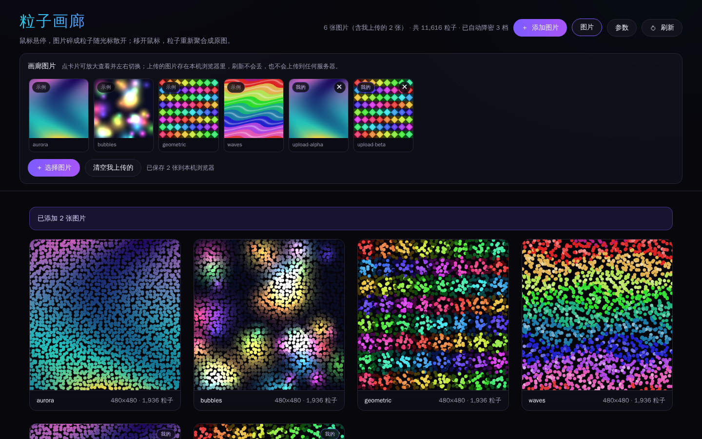
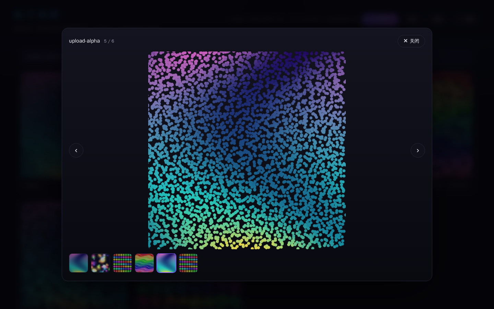

# 粒子画廊 Particle Gallery

**在网页里直接上传、切换、删除图片**，每张图片自动变成粒子画作：鼠标悬停时碎成粒子、从光标位置散开；移开鼠标后粒子平滑聚回原位，还原成原图。

纯前端（原生 HTML / CSS / JS），无后端、无构建步骤，**整个 `dist/` 目录可以直接丢到任何静态托管上**。粒子部分由 npm 包 [`package-particlefx`](https://www.npmjs.com/package/package-particlefx) 驱动。



---

## 快速开始

```bash
cd particle-gallery
npm install            # 安装 package-particlefx，并把它 vendor 进仓库

npm run dev            # 起服务：python3 -m http.server 5173（零依赖）
# npm start            # 或者用 npx serve -l 5173 .（首次会自动下载 serve）
```

浏览器打开 **<http://127.0.0.1:5173/>**，点 **「添加图片」** 就能传自己的图片了。

> ⚠️ 必须通过 http(s) 访问，**不要直接双击 `index.html`**（`file://` 下浏览器会因跨域策略拒绝读取图片像素，粒子取不到颜色）。

---

## 在界面上管理图片（不用碰代码）

| 操作 | 怎么做 |
| --- | --- |
| 添加图片 | 点右上角 **「添加图片」** 选文件（可多选） |
| 添加图片 | 把图片**直接拖到页面上**任意位置 |
| 添加图片 | 复制图片后在本页按 <kbd>Ctrl</kbd>+<kbd>V</kbd> 粘贴（截图后特别顺手） |
| 查看/删除 | 点 **「图片」** 打开面板，缩略图上有 **✕** 的可以删 |
| 批量删除 | 面板里 **「清空我上传的」** |
| 放大查看 | 点任意卡片，用 **◀ ▶ / ← → 方向键 / 底部缩略图** 切换图片，<kbd>Esc</kbd> 关闭 |

上传的图片存在你自己浏览器的 **IndexedDB** 里：刷新不丢，**不会上传到任何服务器**，卸载或清空浏览器数据才会没有。



### 想让图片「随项目一起部署」给别人看

网页上传的图片只存在你自己的浏览器里。如果要让访客一打开就看到某些图片，把它们放进 `images/` 再重新打包：

```bash
cp 你的图片.jpg images/
node generate-list.js     # 重新生成 images.json
npm run build             # 重新打包 dist/
```

页面会同时展示「内置图片」和「访客自己上传的图片」。

---

## 部署到网页上

```bash
npm run build      # 产出 dist/（约 1.3MB，不含 node_modules）
```

`dist/` 里是完整可用的静态站点，且**不依赖任何后端、不依赖 node_modules**（粒子引擎已经从 npm 包复制到 `vendor/`）。所有路径都是相对的，放在**子目录**下也能正常工作。

**任意静态服务器**：把 `dist/` 里的内容上传到网站根目录即可。
本地预览：`npm run preview`（= `npx serve -l 5173 dist`）。

**GitHub Pages**

```bash
# 1. 提交代码（node_modules 和 dist 已在 .gitignore 里忽略）
git add . && git commit -m "粒子画廊" && git push

# 2. 让 dist/ 出现在 pages 目录里
npm run build
cp -r dist docs            # 然后把 docs/ 也提交上去

# 3. 仓库 Settings → Pages → Source 选 "Deploy from a branch"，
#    Branch 选 main、目录选 /docs，保存后访问：
#    https://<用户名>.github.io/<仓库名>/
```

**Netlify / Vercel**：把 `dist/` 目录拖进部署面板，或在项目设置里把 *Publish / Output Directory* 填成 `dist`，构建命令留空（纯静态，无需构建）。

**Cloudflare Pages**：Build command 留空，Build output directory 填 `dist`。

> 静态托管上忘记跑 `generate-list.js` 也没关系：页面会检测到缺少 `images.json`，自动回退到示例图片列表并给出提示，不会白屏。

---

## 常用命令

| 命令 | 作用 |
| --- | --- |
| `npm run dev` | 本地起服务（Python，零依赖） |
| `npm start` | 本地起服务（npx serve） |
| `npm run build` | 打包成可部署的 `dist/` |
| `npm run preview` | 预览打包结果 |
| `npm run list` | 扫描 `images/` 生成 `images.json` |
| `npm run vendor` | 从 node_modules 同步粒子引擎到 `vendor/` |
| `npm run samples` | 重新生成 4 张示例图片 |
| `npm run verify` | 无头浏览器全流程验收（可选，需 playwright） |

---

## 参数

网页右上角 **「参数」** 按钮可以实时调整，改完立即生效：

| 界面名称 | 作用 | 默认 |
| --- | --- | --- |
| 散开力度 | 鼠标推开粒子的强弱 | 55 |
| 回归速度 | 粒子聚回原位的快慢 | 0.12 |
| 粒子密度 | 粒子数量（×），越高越细腻 | 1.0 |
| 噪点 | 粒子的随机抖动 | 2 |
| 粒子形状 | 圆形 / 方块 / 三角 | 圆形 |

### 参数名对照（重要）

需求里提到的 `forceSpeed` / `returnSpeed` / `radius` **并不是 `package-particlefx` 的选项名**。这个库实际只有下面这些（见 `node_modules/package-particlefx/dist/types.d.ts`），本项目做了如下映射：

| 常见说法 | 本库真实选项 | 说明 |
| --- | --- | --- |
| 散开力度 / forceSpeed | `mouseForce` | 光标对粒子的斥力强度 |
| 回归速度 / returnSpeed | `gravity` | 越大回得越快（库内部换算成阻尼系数） |
| 粒子大小 / radius | `particleGap` | 本库中**粒子直径 ≈ particleGap**，间距同时决定密度，两者无法独立设置 |
| 密度 | `particleGap` | 同上，界面上的「粒子密度」就是换算 `particleGap` |
| 颜色取自图片 | 无需配置 | 库内部用 `getImageData` 逐像素采样，默认就是图片原色 |

想改默认值，编辑 `main.js` 顶部的 `DEFAULTS` 与 `TOTAL_BUDGET` / `MAX_SIDE`。

---

## 目录结构

```
particle-gallery/
├── index.html                 页面结构
├── style.css                  样式（深色、响应式）
├── main.js                    入口：图片清单、画廊、参数、自动画质
├── js/
│   ├── storage.js             上传图片的本地存储（IndexedDB）
│   └── lightbox.js            大图查看与左右切换
├── vendor/
│   └── package-particlefx.es.js   粒子引擎（构建产物副本，随仓库提交）
├── images/                    随项目部署的图片（含 4 张示例图）
├── images.json                由 generate-list.js 生成
├── generate-list.js           扫描 images/ → images.json
├── scripts/
│   ├── build-static.js        打包 dist/
│   ├── vendor-lib.js          同步粒子引擎到 vendor/
│   └── generate-samples.js    纯 Node 生成示例图（无依赖）
├── tests/fixtures/            自动验收用的测试图片
├── verify.js                  无头浏览器全流程验收
├── dist/                      打包产物（npm run build，已 gitignore）
└── screenshots/               效果截图
```

---

## 实现要点

**图片来源**：内置（`images/` + `images.json`）和上传（IndexedDB 里的 Blob，转成 `blob:` URL）在同一个列表里合并展示。Blob URL 是同源的，所以 canvas 取像素不会被污染，粒子颜色照常取自图片。

**性能**：粒子数直接决定每帧开销（本工程实测每粒子约 6~7µs + 每画布约 3ms 固定开销），所以做了四层控制：

1. **图片先降采样** —— 等比缩到最长边 480px（移动端 380px，大图查看 720px）再采样，避免大图产生几十万粒子；
2. **总预算分摊** —— 同时动画的卡片共享一份粒子预算（桌面 14000 / 移动 6500），通过 `particleGap` 换算；
3. **按需动画** —— 只有「被悬停」的卡片持续跑动画；卡片进入视口时错峰播一段入场动画后自动停帧，离开视口立即停帧。空闲时 0 张卡片在动画，不耗 CPU/电；
4. **运行时自动降密** —— 加载后实测帧率，低于 45fps 就自动下调粒子密度（最多 3 档），并在状态栏注明「已自动降密 N 档」。用户一旦手动拖动「粒子密度」，自动降密就不再干预。

**交互**：悬停散开 / 移开聚合由库的 `mousemove` + `mouseleave` 驱动，本项目只负责在悬停时唤醒动画、移开后多跑 1.6s 让粒子归位再停帧。

---

## 自动验收（可选）

```bash
npm run dev            # 另开一个终端先起服务器
npm run verify         # 需要 devDependency playwright + chromium
```

`verify.js` 会用真实 Chromium 跑 30 项检查：控制台无报错、每张图都有粒子且真的画在 canvas 上、悬停时光标附近粒子被推开、移开后粒子回到原位、按需动画确实带来提速、刷新可重建、参数面板与滑块真的作用到引擎、移动端单列无横向溢出，以及**图片管理全流程**（上传 → 缩略图/角标/可删除项 → 刷新页面后仍在 → 大图切换 → 删除 → 清空 → 删除是持久的）。截图输出到 `screenshots/verify/`。

> 该脚本需要 `npx playwright install chromium`（约 115MB）。不想装的话删掉 `devDependencies.playwright` 和 `verify.js` 即可，不影响页面运行。

---

## 已知限制

- `file://` 直接打开无法工作（取不到图片像素），必须走 http(s)。
- 上传的图片存在**本机浏览器**里，换设备/换浏览器看不到；想让所有人看到请放进 `images/` 一起部署。
- 单张上传上限 12MB，支持 jpg / png / webp / gif / avif / bmp。
- 浏览器隐私模式或禁用 IndexedDB 时，上传会退回内存暂存（页面会提示），刷新即丢。
- 极慢的设备上会自动降到较稀疏的粒子密度以保证流畅；可用「参数 → 恢复默认」手动改回最密。
- 粒子引擎的 `destroy()` 没有移除它自己注册在 `window` 上的 `resize` 监听（第三方库的小瑕疵）；本项目始终用像素值设定 canvas 尺寸，因此该监听不会触发重建，无实际影响。
